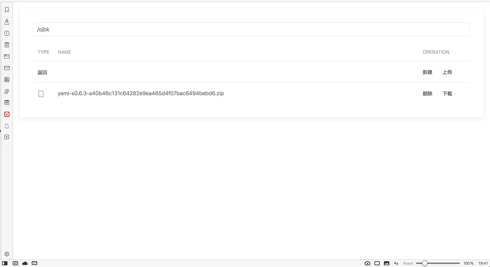
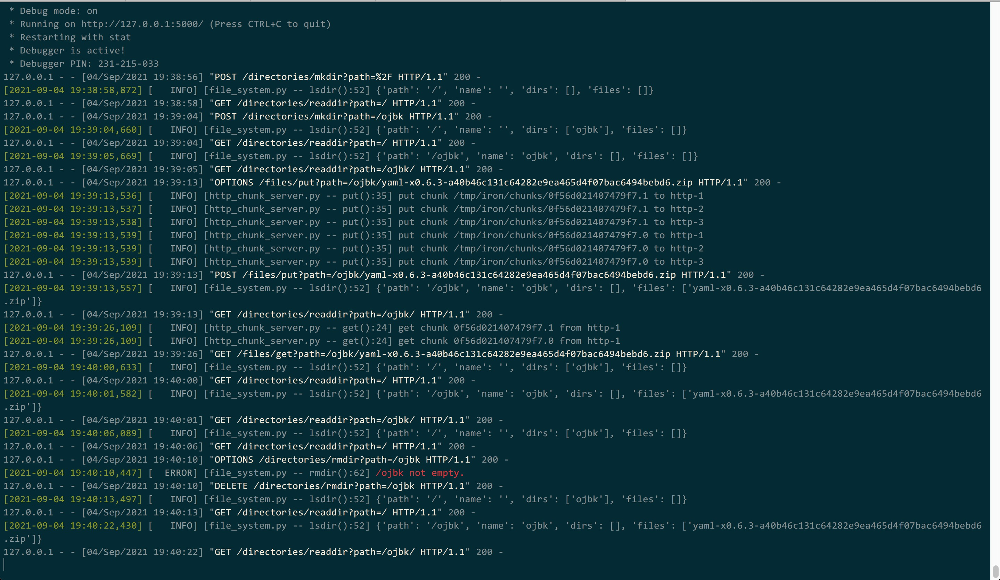
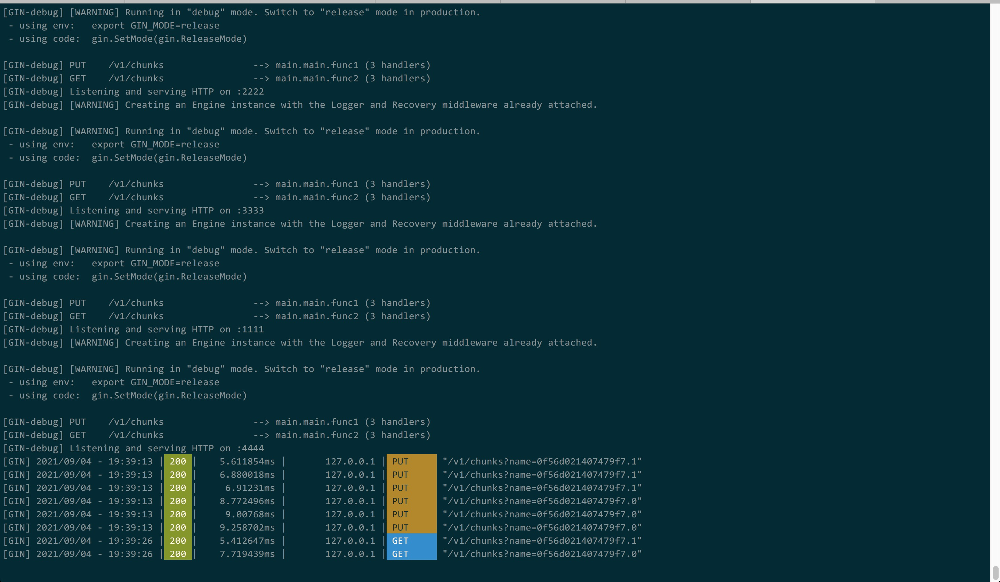

## Iron

### How to develop?

```bash
$ git clone https://github.com/iron-project/iron.git
$ cd iron
$ python3.8 -m venv .env
$ . .env/bin/activate
$ python setup.py develop
```

### Hot to do unit test?

```bash
$ python -m unittest iron/*/*_test.py
```

#### How to package?

```bash
$ python setup.py sdist bdist_wheel
$ python -m twine upload --repository-url https://test.pypi.org/legacy/ dist/*
```






